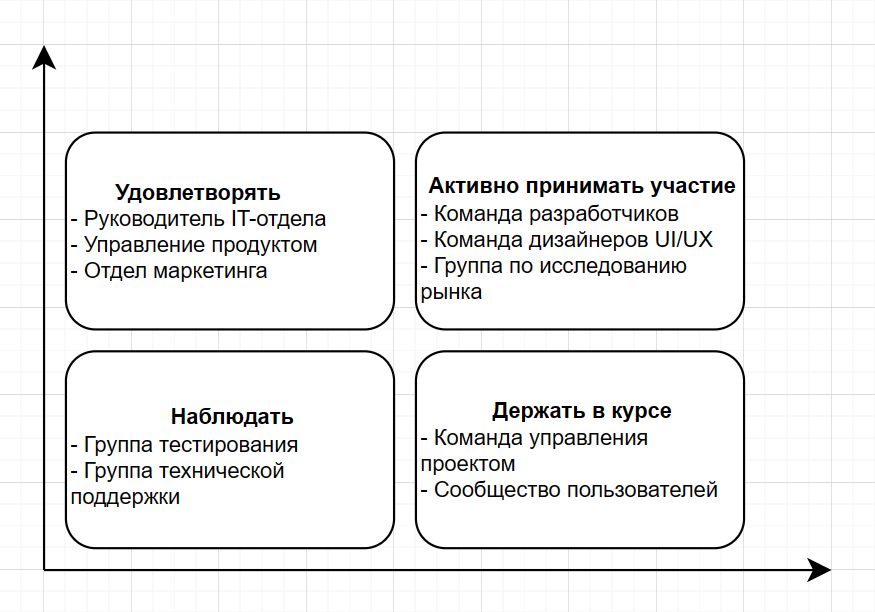

# Матрица заинтересованности

#Удовлетворять  
:• Руководитель ИТ-отдела: Обеспечить эффективное и безопасное внедрение системы, отвечающее потребностям пользователей.  
:• Управление продуктом: обеспечить, чтобы система персональных рекомендаций развивалась в правильном направлении и соответствовала бизнес-целям компании.  
:• Отдел маркетинга: убедитесь, что система способна привлекать и удерживать пользователей, предоставляя привлекательные персональные рекомендации фильмов.  
#Активно принимать участие  
• Команда разработчиков: Разработайте и внедрите систему индивидуальных предложений на основе требований и формата проекта.
• Команда дизайнеров UI/UX: создавайте привлекательные и простые в использовании пользовательские интерфейсы, обеспечивающие максимальное удобство работы с пользователем.
• Группа исследования рынка: собирайте и анализируйте отзывы пользователей для улучшения системы персональных рекомендаций.
#Наблюдать
• Группа тестирования: проводит тестирование системы для обеспечения стабильности и качества проекта.
• Группа технической поддержки: обеспечивает техническую поддержку и решает технические проблемы, возникающие после развертывания.
#Держать в курсе
• Команда управления проектом: информируйте и сообщайте о ходе проекта и изменениях заинтересованным сторонам.
• Сообщество пользователей: Предоставляйте информацию и рекомендации по использованию системы персональных рекомендаций, а также прислушивайтесь к их отзывам, чтобы улучшить взаимодействие с пользователем.
