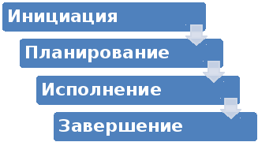

## Вопрос 1 
### 1.	В чем отличия программ и проектов? Как они связаны между собой?
Цель **проекта** - добиться желаемого результата, в то время как **программа** - постоянно улучшать деятельность компании.  
**Проект** – совокупность мероприятий, состоящая из взаимосвязанных задач, с четко определенными целями, графиками и бюджетами, сложные деятельности, имеющют начало и конец.  
**Программа** – долгосрочная деятельность, включающая реализацию множества проектов. Сфера действия программы шире, чем проекта, поскольку она включает в себя работу не одного, а множества различных функциональных блоков.  
### 2.	Определите, какие виды деятельности из списка относятся к проектам, а какие — нет. В этом списке некоторые виды деятельности могут быть при определенных условиях оценены как проекты. Каковы эти условия?
#### 1)	создание нового продукта; - да 
- Потому что оно может включать в себя множество этапов, таких как исследование рынка, разработка идеи, проектирование и производство нового продукта.
- При заданном бюджете, ресурсах и времени создание нового продукта можно организовать как проект для достижения конкретной цели.
#### 2)	реорганизация структуры фирмы; - да
- Поскольку включает в себя изменение организационной структуры фирмы, внедрение новых стратегий и процессов. 
- Реорганизация может быть проведена с определенной целью, имеющей сроки и бюджет.
#### 3)	разработка нового транспортного средства; - да
- Так как включает в себя различные этапы, такие как проектирование, создание прототипа, тестирование и внедрение нового транспортного средства. 
- Для успешной разработки нового транспортного средства требуется определенное время, ресурсы и бюджет, что делает данную задачу типичным проектом.
#### 4)	строительство склада; - да
- Так как включает в себя все процессы, начиная от выбора места строительства и проектирования до завершения работ. 
- Строительство склада требует определенного времени, ресурсов и управления, что является характерными чертами проектной деятельности.
#### 5)	проведение выборной компании партии; - нет
- Проведение выборной компании является ежегодным мероприятием, которое проводится регулярно и не имеет четкой фиксированной цели или временных рамок. 
- Вместо этого, это скорее рутинная деятельность, связанная с политикой и избирательной системой.
#### 6)	внедрение системы автоматического учета на складе; - да
- Так как включает в себя внедрение новой системы, обучение сотрудников и внедрение процессов. 
- В данном случае, целью проекта может быть повышение эффективности складского учета и снижение ошибок при учете товаров.
#### 7)	переезд в новый офис; - да 
- Так как требует планирования, организации и выполнения определенных задач, таких как поиск и аренда помещения, перенос оборудования, изменение адреса во всех необходимых документах и т.д.
#### 8)	организация празднования юбилея шефа. - нет
- Организация празднования юбилея шефа может рассматриваться как одноразовое событие, не связанное с определенной целью или ресурсами. 
- Вместо этого, это скорее является обычным мероприятием, связанным с празднованием и социальными отношениями.
### 3. Назовите и охарактеризуйте стадии и фазы жизненного цикла проекта.

-	**Инициация**. Команда прорабатывает концепцию, готовится к планированию и реализации проекта (проведение маркетинговых мероприятий, подготовку и участие в тендерах, и остальные работы).
-	**Планирование**. Необходимо разработать дорожную карту проекта — документ, к которому каждый участник может обратиться в любое время, чтобы свериться с важными деталями, целями и ожидаемыми результатами.
-	**Исполнение**. На этой стадии команда уже сформирована, проект полностью утвержден, можно переходить к работе.
-	**Контроль**. Работы по контролю стартуют одновременно с инициацией проекта. Необходимо постоянно следить, чтобы все исполнители следовали плану, имели необходимые ресурсы и своевременно выполняли задачи.
-	**Завершение**. Эта фаза завершает проект. На этой стадии задачи решены, цели достигнуты.
